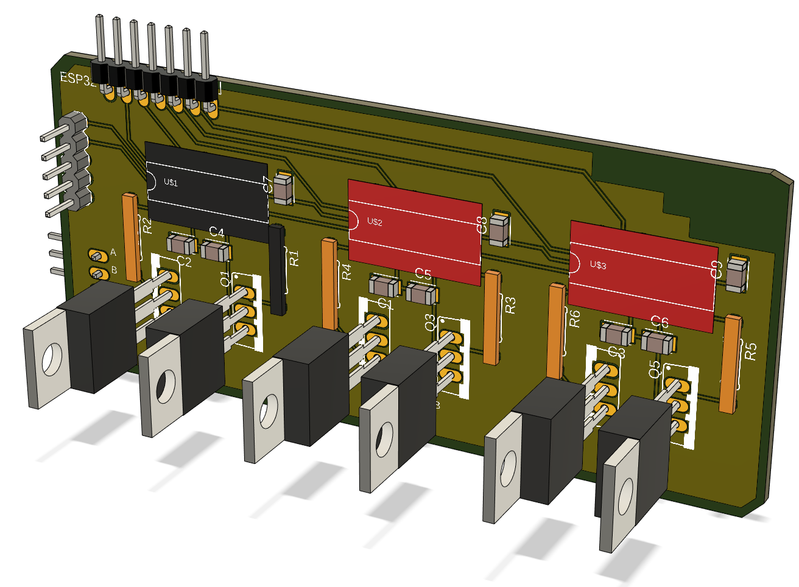
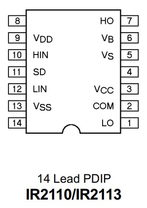
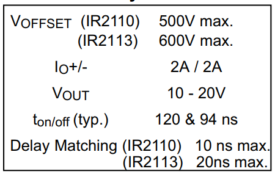
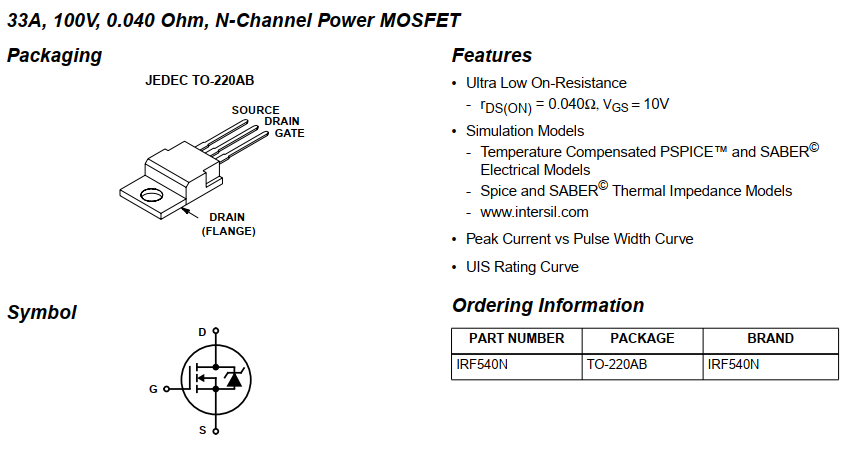
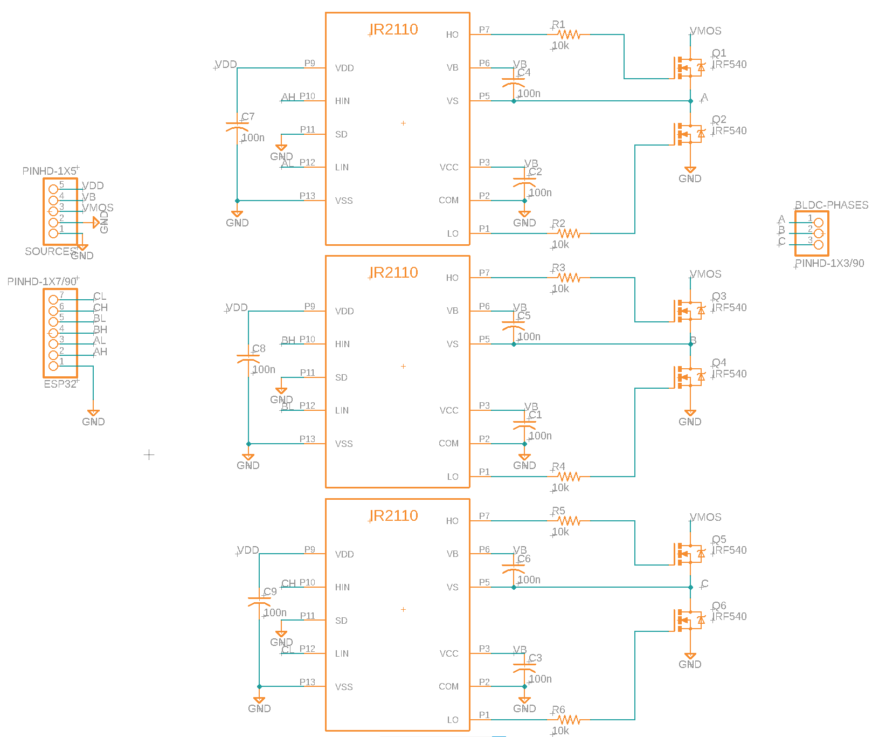

# Brushless Direct Current Motor - Inverter
This repo aims to study the starting algorithms for this type of motor, and to develop a working 3-phase inverter.

## 3-Phase Inverter
For the development of the 3 phase Inverter the actual model uses:
* 3 IR2110 for the MOSFET driver
* 6 IRF540 MOSFETS

## Basic config
* VDD = 5V
* VCC = 15V
* VSS, SD, COM to gnd

## Datasheet for the IR2110

## PinOut

### Specs for the IR2110

### Datasheet for the IRF540N

## Circuit

